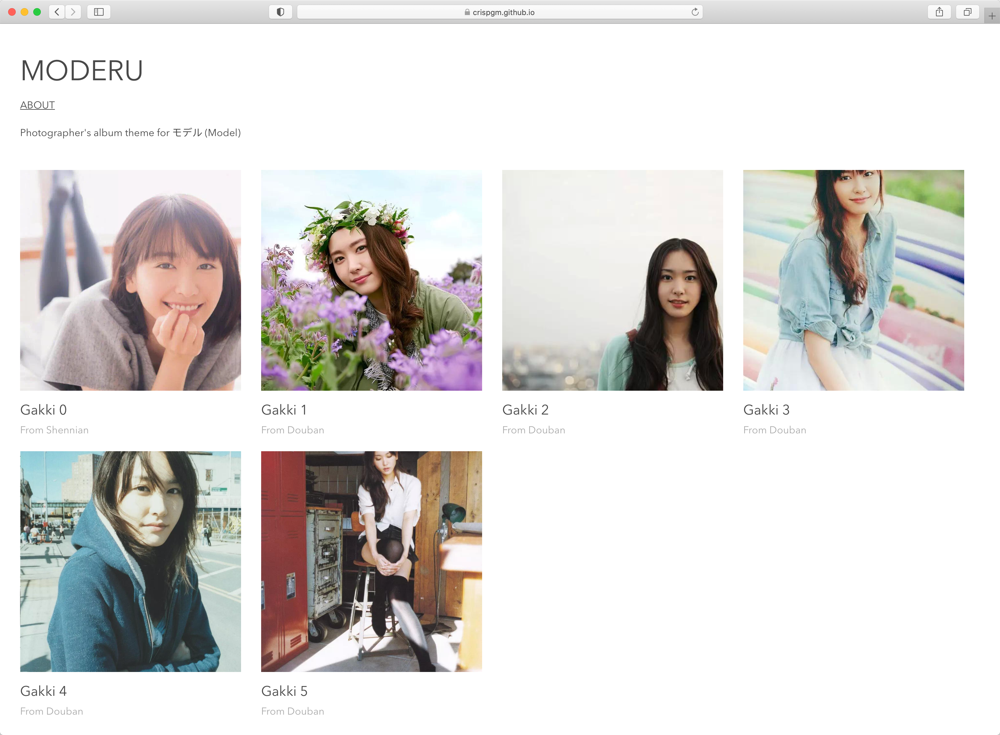

# [Moderu モデル](https://crispgm.github.io/moderu/index.html)

<p align="center">
  
  <a href="https://rubygems.org/gems/jekyll-moderu">
    
  </a>
  
</p>

Moderu is a Jekyll theme designed for photography models, as a place to show their photos.

Moderu is the Romaji of the Japanese word モデル, which actually the English word--model. :)



## Installation

Add this line to your Jekyll site's `Gemfile`:

```ruby
gem "jekyll-moderu"
```

And add this line to your Jekyll site's `_config.yml`:

```yaml
theme: moderu
```

And then execute:

```shell
bundle install
```

Or install it yourself as:

```shell
gem install jekyll-moderu
```

## Usage

### Photos

Edit `_data/photo.yml`:

```yaml
- name: Gakki 1
  desc: From Douban
  file: p2331515866.jpg
  date: 2019-03-11
  place: Tokyo
```

Only `file` is mandatory and others are optional fields. However, it would display better with these fields.

### Colors

There are only 2 colors used in this theme. A major color `$color-major` and a minor color `$color-minor`. Change it in `./assets/style.scss` at your own interest.

### Contacts

Contact's info is configured in `_config.yml`.

```yaml
links:
  - icon: icon-envelope-o
    link: https://link.to/your/page
```

Icon is powered by IcoMoon with FontAwesome icon font and icons of social networks are included by default. e.g. `icon-twitter` for Twitter icon. For more icons, please replace with your own icon pack.

## Showcases

- <https://crispgm.github.io/moderu/index.html>

## Contributing

Bug reports and pull requests are welcome. This project is intended to be a safe, welcoming space for collaboration, and contributors are expected to adhere to the [Contributor Covenant](http://contributor-covenant.org) code of conduct.

## License

The theme is available as open source under the terms of the [MIT License](https://opensource.org/licenses/MIT).
